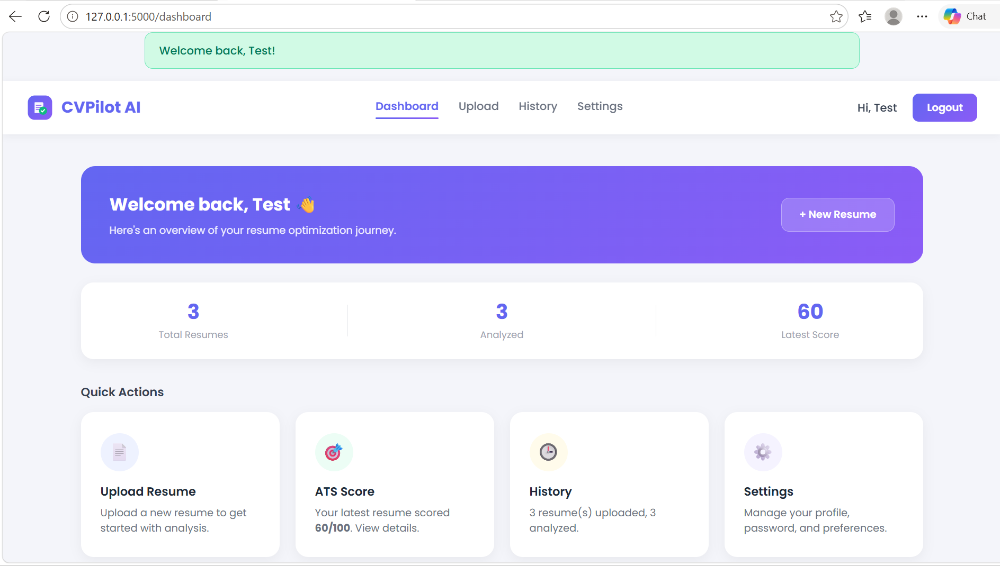
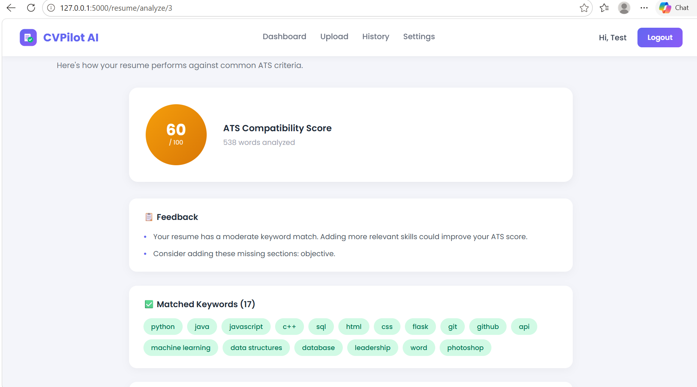
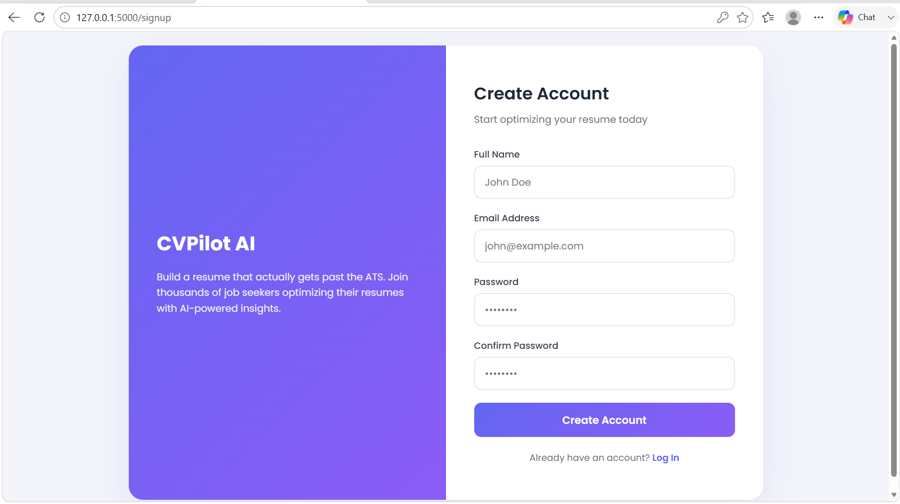

# CVPilot AI

AI-powered Resume Analyzer & ATS Optimization Web Application

## Overview

CVPilot AI helps job seekers and students improve their resumes before applying for jobs or scholarships. It analyzes uploaded resumes, calculates an ATS (Applicant Tracking System) compatibility score, detects missing keywords, and generates professional PDF reports with actionable suggestions.

## Features

- **User Authentication** — Secure signup, login, and session management with password hashing
- **Resume Upload** — Supports PDF and DOCX formats with validation and storage
- **Resume Parsing** — Extracts raw text and content from uploaded resumes
- **ATS Scoring** — Calculates a 0–100 compatibility score based on keyword coverage, section completeness, and resume length
- **Keyword Matching** — Identifies matched and missing industry-relevant keywords
- **PDF Report Generation** — Downloadable, professional analysis reports
- **Resume History** — View, re-analyze, or delete previously uploaded resumes
- **Profile Settings** — Edit profile details and change password

## Screenshots

### Dashboard



### Resume Analysis



### Sign Up



## Tech Stack

**Backend:** Python 3.12, Flask, Flask-SQLAlchemy, Flask-Bcrypt, Flask-Login
**Database:** SQLite
**Frontend:** HTML, CSS, JavaScript
**PDF Processing:** PyPDF2, python-docx, ReportLab

## Project Structure

## Getting Started

### Prerequisites

- Python 3.12+
- pip

### Installation

```bash
git clone https://github.com/aminashujaat123-maker/CVPilot-AI.git
cd CVPilot-AI
python -m venv venv
venv\Scripts\activate   # On Windows
pip install -r requirements.txt
```

### Running the App

```bash
python app.py
```

Visit `http://127.0.0.1:5000` in your browser.

## Roadmap

- [x] **Version 1** — Authentication, Resume Upload, ATS Score, Keyword Match, Basic Report
- [ ] **Version 2** — AI Suggestions, Grammar Checking, Resume Improvement
- [ ] **Version 3** — Dashboard Analytics, Resume History, Professional Charts, Dark Mode
- [ ] **Version 4** — Scholarship Resume Mode, Academic CV Analysis, Cover Letter Generator, LinkedIn Profile Analyzer

## Author

**Amina Shujaat**

## License

This project is for educational and portfolio purposes.
